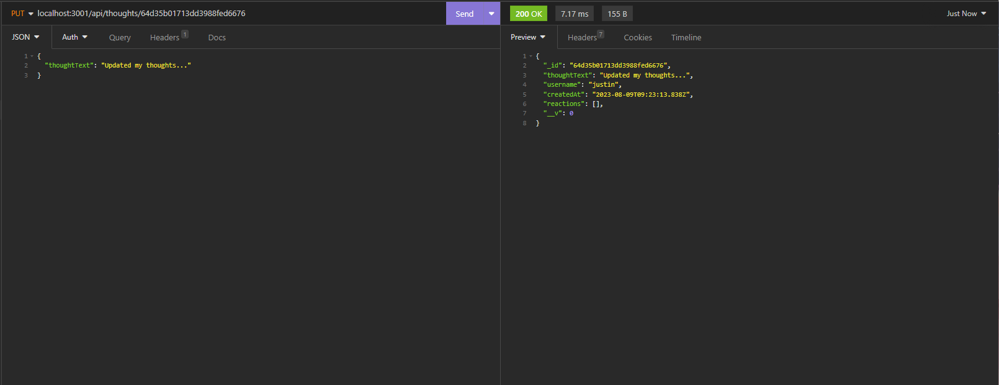

# NoSQL Challenge: Social Network API

## Description
The objective is to create a social network API where users can share thoughts, react to friend's thoughts, and create a friend list. This application
will be using Express.js for routing the API and MongoDB database to store the users, thoughts, and reactions. 

The application will have three models User, Thought, and Reaction. These models will contain the Schema that is needed to create the models. Also for the routing for each model, the routes should contain GET, POST, DELETE, and PUT routes in order to find, create, update, and delete. 

## Technology Used
- Express.js
- MongoDB
- Insomnia

## Testing

This shows that the application is connected to  mongodb and is running

Here updating the thoughts from an user

This screenshot shows all of the users, ids, and thoughts that were created either from creating a thought/user and randomly generated seed.

## Live Recording
[Recording](https://drive.google.com/file/d/1_PsFiLeYGYt13ecq3UGrF5DKcZiZay2X/view)

## Updates 
- 7/31: Wasn't able to connect to insomnia due to issues with routing
- 8/9: Updated the routing so that it can update, create and find all thoughts or by id, which also includes the users. 